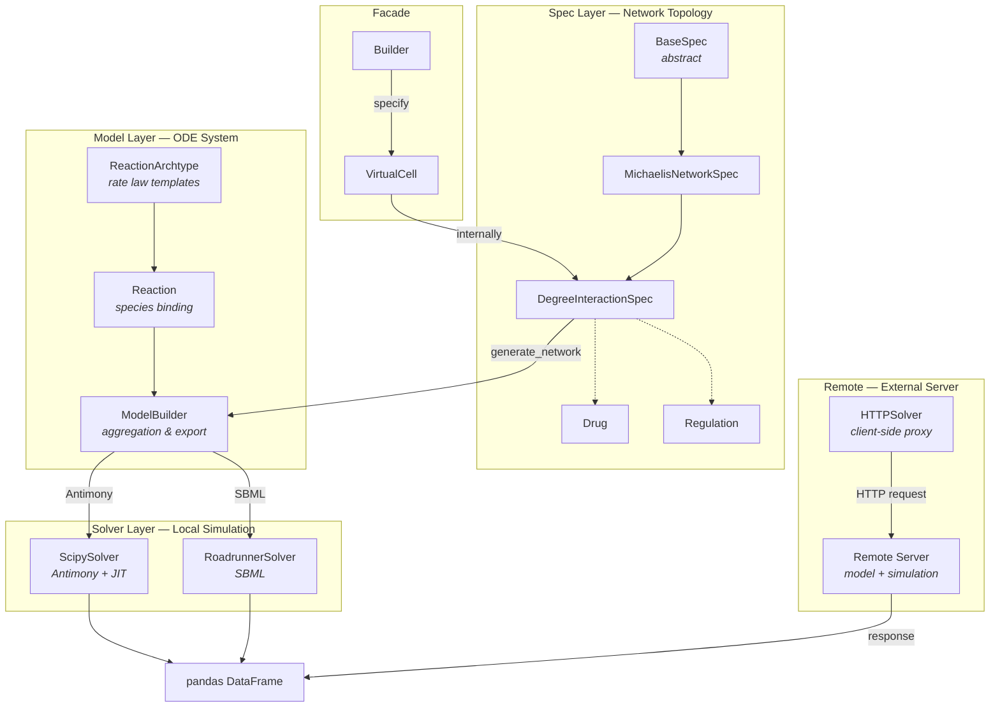
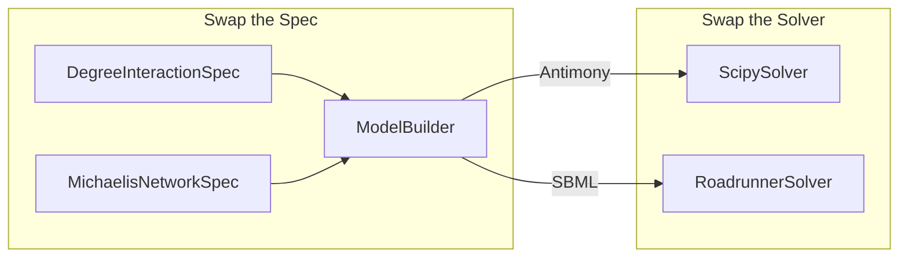

# Architecture

Synthetic follows a **three-layer pipeline** where each layer is independently pluggable. You can swap specs, compose custom reactions, or change solver backends without touching the rest of the system.

## Layers

### Spec Layer — *What the network looks like*

Defines species lists, regulations (including feedback), and drug interactions — no concrete math.

| Class | Role |
|-------|------|
| `BaseSpec` | Abstract base — defines the contract for all specifications |
| `MichaelisNetworkSpec` | Generic Michaelis-Menten networks with drug mechanisms |
| `DegreeInteractionSpec` | Multi-degree hierarchical drug interaction networks |
| `Drug` | Drug species with targets, timing, and regulation type |
| `Regulation` | Feedback and cross-talk regulation rules |

Output: a fully specified network topology passed to `generate_network()`.

### Model Layer — *The actual ODE system*

Converts network topology into a concrete system of reactions with parameters.

| Class | Role |
|-------|------|
| `ReactionArchtype` | Reusable rate law templates (mass action, Michaelis-Menten, etc.) with placeholder species (`&S`, `&R`) |
| `Reaction` | Binds an archtype to real species names and maps regulators to parameters |
| `ModelBuilder` | Aggregates reactions, compiles state/parameter dictionaries, exports Antimony or SBML |

Output: Antimony or SBML model strings ready for simulation.

### Solver Layer — *Runs the math locally*

Pluggable simulation backends with a unified `compile()` / `simulate()` interface. These take a model (Antimony or SBML) and run the ODE integration in-process.

| Class | Input | Best for |
|-------|-------|----------|
| `ScipySolver` | Antimony | Batch simulations, parameter sweeps (optional numba JIT) |
| `RoadrunnerSolver` | SBML | Complex models, single robust simulations |

Output: `pandas DataFrame` with `time` column and species columns.

### HTTPSolver — *Remote simulation*

Unlike the local solvers, `HTTPSolver` does **not** receive a model to simulate. Instead, it acts as a client-side proxy — the remote server owns both the model and the simulation engine. The client only sends simulation parameters and receives results back.

This makes `HTTPSolver` architecturally distinct: it bypasses the local Spec → Model → Solver pipeline entirely, delegating everything to an external service.

| Class | Role |
|-------|------|
| `HTTPSolver` | Client that sends simulation requests to a remote server endpoint |

See [Advanced Features](advanced_features.md) for client and server setup details.

## Modular Flexibility

Each layer has a well-defined interface, so you can:

- **Swap specs** — use `DegreeInteractionSpec` for hierarchical networks or `MichaelisNetworkSpec` for generic topologies
- **Compose reactions** — mix archtypes freely within a single `ModelBuilder` to build arbitrary networks
- **Swap solvers** — the same `ModelBuilder` output feeds any local solver backend

## Supporting Modules

| Module | Purpose |
|--------|---------|
| **utils/** | Parameter randomization, initial condition generation, kinetic tuning, feature/target data helpers |
| **SyntheticGenUtils/** | Data processing, parallel simulation, perturbation strategies, validation |

These are used internally by the high-level API (`Builder`, `make_dataset_drug_response`) but can also be called directly for fine-grained control.

---

**See also:**

- [Model Building](model_building.md) — working with reactions and archtypes directly
- [Network & Drug Design](network_and_drug_design.md) — configuring specs and drugs
- [Solvers & Simulation](solvers_and_simulation.md) — solver configuration and usage
- [Advanced Features](advanced_features.md) — HTTPSolver client and server setup
- [API Reference](api_reference.md) — full API docs for all classes
