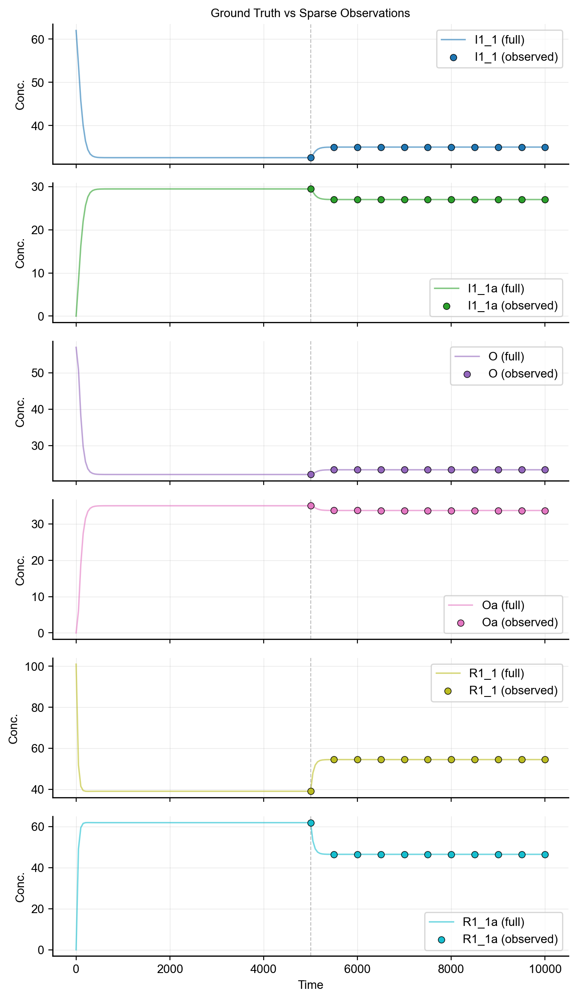
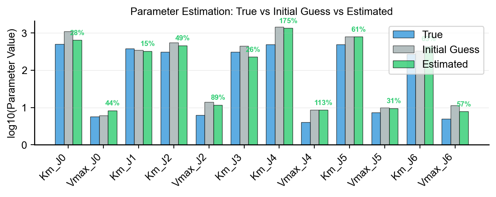
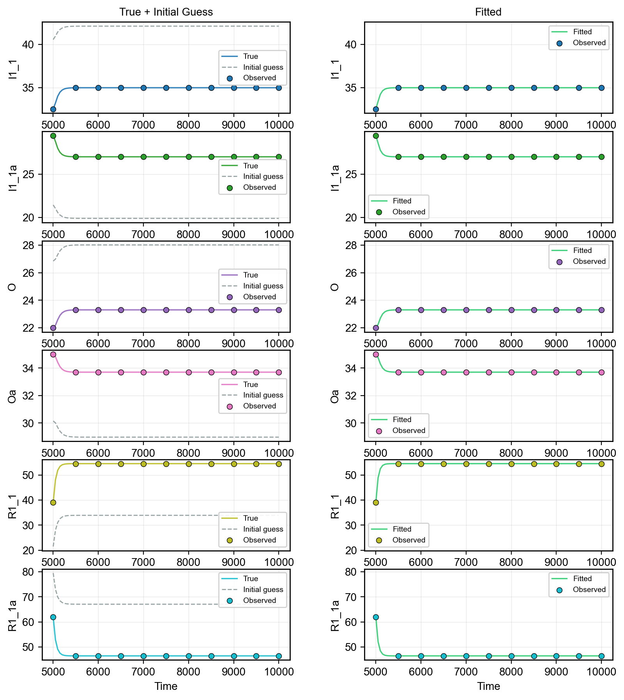
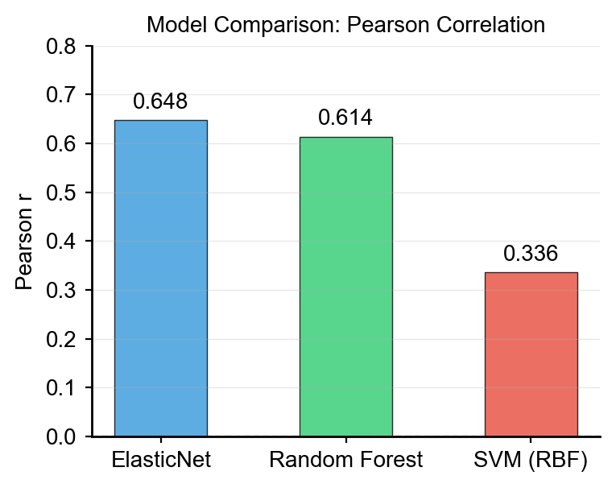

# Benchmarking Scenarios

## Parameter Estimation

Synthetic models can serve as ground truth for testing parameter estimation methods. Since you know the true parameters, you can validate calibration algorithms. Typically, in real experiments, you have sparse timecourse data for a few species, so we will mimic that scenario.

### Setup: Ground Truth + Sparse Observations

```python
import numpy as np
from synthetic import Builder
from synthetic.Solver.ScipySolver import ScipySolver

# Build a small model with known parameters
vc = Builder.specify(degree_cascades=[1, 2], random_seed=42)

# Simulate dense ground truth
antimony = vc.model.get_antimony_model()
solver = ScipySolver()
solver.compile(antimony, jit=False)
timecourse_full = solver.simulate(start=0, stop=10000, step=201)

# Store ground truth
true_params = vc.model.get_parameters()
true_initial = vc.model.get_state_variables()

# Downsample to sparse observations (mimicking real experiments)
DRUG_TIME = 5000.0
sparse_times = np.array([5000, 5500, 6000, 6500, 7000, 7500, 8000, 8500, 9000, 9500, 10000])
sparse_indices = [np.argmin(np.abs(timecourse_full['time'].values - t)) for t in sparse_times]
timecourse_sparse = timecourse_full.iloc[sparse_indices].reset_index(drop=True)
```

### Parameter Selection

Select identifiable parameters for estimation (typically `Km` and `Vmax` values):

```python
param_names = [p for p in true_params.keys() if p.startswith('Km_') or p.startswith('Vmax_')][:12]
true_values = np.array([true_params[p] for p in param_names])
```

### Objective Function

Define an objective that simulates with trial parameters and computes MSE against sparse observations:

```python
species_to_fit = [s for s in timecourse_sparse.columns if s != 'time']

def objective(log_params):
    trial_params = dict(zip(param_names, np.exp(log_params)))
    solver.set_state_values(true_initial)
    solver.set_parameter_values(trial_params)

    try:
        tc = solver.simulate(start=0, stop=10000, step=201)
    except Exception:
        return 1e10  # Penalty for failed simulation

    sim_indices = [np.argmin(np.abs(tc['time'].values - t)) for t in sparse_times]
    residuals = []
    for sp in species_to_fit:
        sim_vals = tc[sp].values[sim_indices]
        obs_vals = timecourse_sparse[sp].values
        residuals.append((sim_vals - obs_vals) ** 2)

    return np.mean(residuals)
```

### Optimization

Run optimization in log-space to enforce positivity:

```python
from scipy.optimize import minimize

# Perturbed initial guess
initial_values = true_values * np.random.uniform(0.3, 3.0, size=len(param_names))
log_initial_guess = np.log(initial_values)
log_bounds = [(np.log(0.01 * tv), np.log(100.0 * tv)) for tv in true_values]

result = minimize(
    objective,
    log_initial_guess,
    method='L-BFGS-B',
    bounds=log_bounds,
    options={'maxiter': 200, 'ftol': 1e-12},
)

estimated_values = np.exp(result.x)
```

### Evaluating Results

Compare estimated parameters to ground truth:



```python
for i, p in enumerate(param_names):
    err = abs(estimated_values[i] - true_values[i]) / true_values[i] * 100
    print(f"{p:<15} True: {true_values[i]:.3f}  Estimated: {estimated_values[i]:.3f}  Error: {err:.1f}%")
```

Simulate with estimated parameters to visualize the fit:





```python
solver.set_state_values(true_initial)
solver.set_parameter_values(dict(zip(param_names, estimated_values)))
timecourse_fitted = solver.simulate(start=0, stop=10000, step=201)
```

## ML Benchmarking

Synthetic datasets are designed for benchmarking machine learning models with known ground truth.

### Train/Test with sklearn



```python
from sklearn.ensemble import RandomForestRegressor
from sklearn.model_selection import train_test_split

X, y = make_dataset_drug_response(n=1000, cell_model=vc, target_specie='Oa')

X_train, X_test, y_train, y_test = train_test_split(X, y, test_size=0.2, random_state=42)

model = RandomForestRegressor(random_state=42)
model.fit(X_train, y_train)
score = model.score(X_test, y_test)
print(f"R^2 score: {score:.3f}")
```

### Comparing Feature Types

Compare predictive power of different feature representations:

```python
from sklearn.linear_model import LinearRegression
from sklearn.model_selection import cross_val_score

# Initial values as features (default X)
r2_initial = cross_val_score(LinearRegression(), X, y, cv=5, scoring='r2').mean()

# Kinetic parameters as features
r2_params = cross_val_score(LinearRegression(), parameters, y, cv=5, scoring='r2').mean()

# Timecourse last-point features (activated species only)
X_tc = X_timecourse[[c for c in X_timecourse.columns if c.endswith('a') and c != 'Oa']]
r2_tc = cross_val_score(LinearRegression(), X_tc, y, cv=5, scoring='r2').mean()

print(f"Initial values R^2: {r2_initial:.3f}")
print(f"Kinetic params R^2: {r2_params:.3f}")
print(f"Timecourse R^2: {r2_tc:.3f}")
```

---

**See also:**

- [Data Generation](data_generation.md) — generating datasets for benchmarking
- [Model Export & Interoperability](model_export.md) — exporting models for external tools
- [Advanced Features](advanced_features.md) — kinetic tuning and HTTP solver
- [API Reference](api_reference.md) — full API docs
