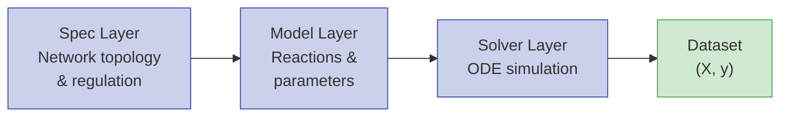
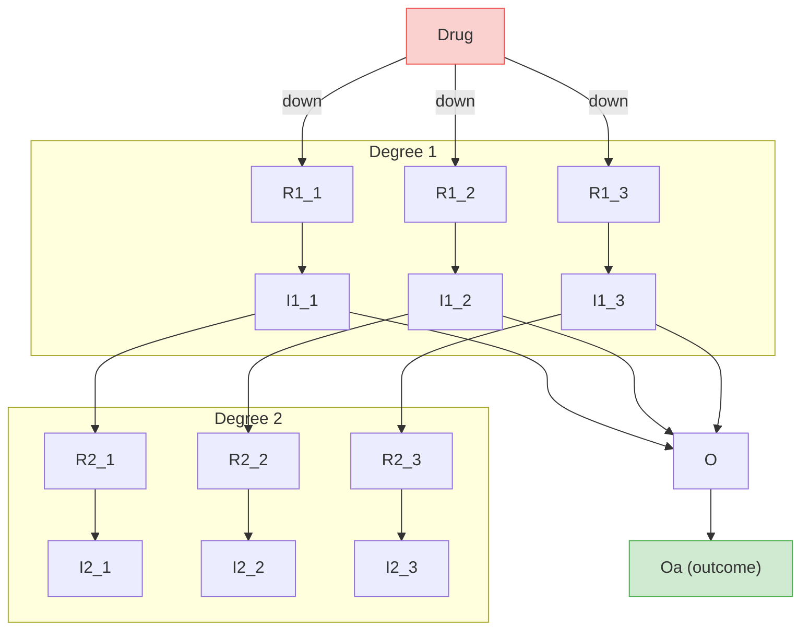

# Synthetic

Synthetic is a library for generating virtual cell data using ODE models based on biochemical laws common in cancer cell signaling networks. It creates datasets compatible with scikit-learn's `make_regression` format.

## Why Synthetic?

Real cell signaling data is expensive to generate, difficult to replicate, and often incomplete. Synthetic lets you generate **unlimited, labeled datasets** with full control over network topology, drug mechanisms, and parameter distributions — making it ideal for:

- **ML benchmarking** — train and evaluate models on data with known ground truth
- **Method development** — test new algorithms against biologically plausible signaling cascades
- **Drug response modeling** — simulate combination therapies with configurable up/down regulation
- **Education** — explore how network structure drives emergent behavior in signaling pathways

## Architecture

Synthetic follows a three-layer abstraction that separates *what* the network looks like from *how* it's simulated:



| Layer | Purpose | Key Classes |
|-------|---------|-------------|
| **Spec** | Define species, regulations, drug interactions | `DegreeInteractionSpec`, `MichaelisNetworkSpec` |
| **Model** | Instantiate reactions, assign parameters, generate Antimony/SBML | `ModelBuilder`, `Reaction`, `ReactionArchtype` |
| **Solver** | Run ODE simulations with pluggable backends | `ScipySolver`, `RoadrunnerSolver` |

## Example Network

A typical hierarchical network with drug targeting. Each cascade converts a receptor (`R`) into its activated form (`I`), propagating the signal downstream toward the outcome `O`:



This network was created with `degree_cascades=[3, 5]` — 3 cascades at degree 1 and 5 at degree 2.

## Features

- **Hierarchical network generation** with configurable degree cascades and feedback regulation
- **Drug response modeling** with customizable drug mechanisms (up/down regulation)
- **Multiple solver backends** (SciPy, libRoadRunner, HTTP)
- **Biologically plausible parameters** via kinetic parameter tuning
- **Scikit-learn compatible** datasets for ML benchmarking
- **SBML/Antimony export** for interoperability with other tools

## Installation

The most recommended way to install Synthetic is via PyPI, which is the latest stable release:

```bash
pip install synthetic-models
```

to install the latest from GitHub:

```bash
pip install git+https://github.com/synthetic-models/synthetic.git
```

### Optional dependencies

| Extra | Install | Description |
|-------|---------|-------------|
| RoadRunner solver | `pip install synthetic-models[roadrunner]` | libRoadRunner SBML simulation engine — an alternative solver backend with mature SBML support |
| Plotting | `pip install synthetic-models[plotting]` | matplotlib, seaborn, networkx, and Jupyter — for visualizing networks and simulation results |
| Scikit-learn | `pip install synthetic-models[sklearn]` | scikit-learn — for ML pipeline integration and dataset utilities |

Install multiple extras at once:

```bash
pip install synthetic-models[roadrunner,plotting,sklearn]
```

### Install from source

If you can't access PyPI, download a `tar.gz` release from [GitHub releases](https://github.com/synthetic-models/synthetic/tags) and install locally:

```bash
pip install synthetic-models-0.1.3.tar.gz
```

### Build from source

This project is developed using [uv](https://docs.astral.sh/uv/), which is the recommended way to build from source:

```bash
git clone https://github.com/synthetic-models/synthetic.git
cd Synthetic
uv sync
```

## Quick Start

!!! tip "Generate your first dataset in 3 lines"

    ```python
    from synthetic import Builder, make_dataset_drug_response

    vc = Builder.specify(degree_cascades=[3, 5], random_seed=42)
    X, y = make_dataset_drug_response(n=1000, cell_model=vc, target_specie='Oa')
    ```

Head to the [Quick Start](quick_start.md) guide for more details.

## Documentation

| Section | Description |
|---------|-------------|
| [Quick Start](quick_start.md) | Installation and first dataset in 3 lines |
| [Model Building](model_building.md) | Custom reactions, archtypes, and the three-layer API |
| [Network & Drug Design](network_and_drug_design.md) | Degree cascades, feedback, drug mechanisms, combination therapy |
| [Solvers & Simulation](solvers_and_simulation.md) | Solver backends, timecourse simulation, HTTP solver |
| [Data Generation](data_generation.md) | Perturbation strategies, extended formats, feature analysis |
| [Advanced Workflows](advanced_workflows.md) | Kinetic tuning, parameter estimation, model export, ML benchmarking |
| [API Reference](api_reference.md) | Auto-generated API docs from source docstrings |
| [FAQ](faq.md) | Common questions and troubleshooting |
