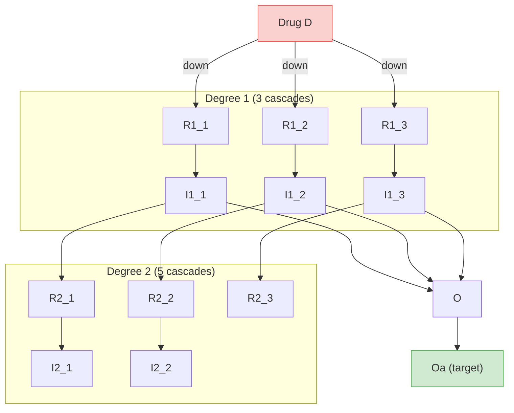

# Model Building

The first capability Synthetic gives you: **describe the network you want to simulate**. Every model, regardless of complexity, ends up as a `ModelBuilder` — a container of reactions. This page covers the three levels of control you have over what goes into one, and how to export the result for use in other tools.

The model you build here is the input to [Solving ODEs](solving_odes.md) — pick a solver, run a simulation, get a timecourse.

## The Three Levels

The library gives you three ways to build a model, ordered by how much of the biology you write yourself:

| Level | Entry point | What you write | What you get |
|---|---|---|---|
| 1 | `Builder.specify(degree_cascades=...)` | A size list `[3, 5, ...]` | A `VirtualCell` wrapping a hierarchical Michaelis-Menten network with an auto-drug and a kinetic tuner. Fastest path. |
| 2 | `DegreeInteractionSpec` or `MichaelisNetworkSpec` directly | Species, regulations, drugs as Python objects | A `ModelBuilder` with the topology chosen by the spec. Full control over what's included. |
| 3 | `ModelBuilder` + `Reaction` + `ReactionArchtype` | Each reaction by hand, including rate laws | A `ModelBuilder` with whatever you assembled. Full control over everything. |

All three paths converge on the same downstream machinery — solvers, simulation, dataset generation, export — so picking one doesn't lock you out of anything that comes after.

---

## Level 1 — `Builder.specify(degree_cascades=...)`

The shortcut. A single size parameter produces a hierarchical Michaelis-Menten network, an auto-drug, a kinetic tuner, and the `make_dataset_drug_response` integration — see [Quick Start](quick_start.md) for the 3-line example.

```python
from synthetic import Builder, make_dataset_drug_response

vc = Builder.specify(degree_cascades=[3, 5], random_seed=42)
X, y = make_dataset_drug_response(n=1000, cell_model=vc, target_specie='Oa')
```

`Builder.specify` is hardcoded to wrap `DegreeInteractionSpec` with `degree_cascades=...`. If you need a different topology, or full control over drugs and tuning, drop to Level 2.

---

## Level 2 — The Spec Classes

A *specification* (or "spec") is a Python object that captures three things:

- **Species** — the named chemical entities in the model (e.g. `EGFR`, `pEGFR`, `ERK`)
- **Regulations** — how one species affects the conversion rate of another (`ERK` inhibits the `MEK → pMEK` step, etc.)
- **Drugs** — special species that appear at a specified time and regulate a target

The library ships with two specs:

| Spec | Topology it produces |
|------|----------------------|
| `DegreeInteractionSpec` | Hierarchical Michaelis-Menten — a stack of "degree" levels, each with N parallel cascades. Parameterized by `degree_cascades=[3, 5, ...]`. |
| `MichaelisNetworkSpec` | Arbitrary Michaelis-Menten — a flat network of N species with R random regulations. Parameterized by `num_species` and `num_regulations`. |

### `DegreeInteractionSpec` — Hierarchical Michaelis-Menten

You can enter this spec two ways:

- `Builder.specify(degree_cascades=[3, 5], ...)` — the Level 1 convenience wrapper.
- `DegreeInteractionSpec(degree_cascades=[3, 5])` directly — returns a spec object you then compile with `generate_network(...)` to get a bare `ModelBuilder`. No auto-drug, no tuner. Use this when you want full control over drugs and tuning, or when you need to combine the spec with other code.

Both produce the same network topology, parameterized by `degree_cascades` — a list where each element is the number of parallel signaling cascades at one *degree* of the hierarchy:

```python
# Either form works
vc = Builder.specify(degree_cascades=[3, 5], random_seed=42)
# 3 cascades at degree 1 (top), 5 at degree 2, plus an outcome species

# Or:
from synthetic.Specs.DegreeInteractionSpec import DegreeInteractionSpec
spec = DegreeInteractionSpec(degree_cascades=[3, 5])
spec.generate_specifications(random_seed=42, feedback_density=0.5)
# ... add drugs manually ...
model = spec.generate_network("MyNetwork")
```

Each cascade at degree `d` creates a receptor species `R{d}_{i}` that converts (via a Michaelis-Menten reaction) into an intermediate `I{d}_{i}`. Degree 1 intermediates feed into the outcome `O`, which is converted to its activated form `Oa`.



Color legend: green = stimulation, red = inhibition, dashed purple = drug regulation. The diagram above shows degree 1 and a partial degree 2 for readability; a `[3, 5]` network actually has 5 cascades at degree 2.

The network image below is the rendered version of the same hierarchy:


#### Species Naming Convention

| Pattern | Meaning | Example |
|---------|---------|---------|
| `R{deg}_{idx}` | Receptor species at degree `deg` | `R1_1`, `R2_3` |
| `I{deg}_{idx}` | Intermediate species at degree `deg` | `I1_1`, `I3_15` |
| `{name}a` | Activated form of a species | `R1_1a`, `I2_1a`, `Oa` |
| `O` / `Oa` | Outcome species (inactive / activated) | — |

The activated form is the catalytically active version. Each reaction in the network converts the inactive form of a species into its active `a` form, propagating the signal forward. `Oa` is the terminal node — what your model predicts.

#### Choosing a Network Size

| Goal | `degree_cascades` | Notes |
|------|-------------------|-------|
| Smoke test, fast iteration | `[1, 2]` | 6 species, milliseconds per simulation |
| Default ML benchmark | `[3, 5]` | ~25 species, used in [Quick Start](quick_start.md) |
| Realistic medium network | `[3, 6, 15]` | ~75 species, exercises 3-level regulation |
| Stress test | `[3, 6, 15, 25]` | ~150 species, large parameter space |

The same `degree_cascades` and `random_seed` always produces the same network.

#### Feedback Regulation

A purely feed-forward hierarchy is biologically unrealistic — real pathways have feedback. The `feedback_density` parameter controls what fraction of possible feedback edges are added:

```python
vc = Builder.specify(degree_cascades=[3, 6, 15], feedback_density=0.5)
```

- `0` — no feedback, pure feed-forward hierarchy
- `1` — every possible feedback edge present
- `0.5` (default) — half of the possible feedback edges, randomly chosen

A feedback edge means a downstream species regulates a reaction in a species upstream of it. The network picture doesn't show them — they appear as additional `extra_states` on reactions. To see them:

```python
model = vc.model
print(model.get_regulator_parameter_map())
# {'I2_3': {'Kc0_J0': ...}, 'R3_5': {'Ka0_J2': ...}, ...}
```

### `MichaelisNetworkSpec` — Arbitrary Michaelis-Menten

When you want Michaelis-Menten kinetics but *not* a hierarchical layout — e.g., a flat network of arbitrary species with arbitrary regulations — use `MichaelisNetworkSpec` directly. It is *not* exposed through `Builder.specify`; you instantiate it yourself:

```python
from synthetic.Specs.MichaelisNetworkSpec import MichaelisNetworkSpec

spec = MichaelisNetworkSpec()
spec.generate_specifications(num_species=5, num_regulations=8, random_seed=42)
spec.add_drug(...)  # same Drug API as DegreeInteractionSpec
model = spec.generate_network("my_network")
```

`generate_specifications(num_species=..., num_regulations=...)` is the analogue of `degree_cascades`: it picks a random topology of the requested size. The species names are generated for you (`S1`, `S2`, ...) — there's no fixed naming convention because there's no fixed topology. For full control, add species and regulations manually:

```python
spec = MichaelisNetworkSpec()
spec.add_species("EGFR"); spec.add_species("pEGFR"); spec.add_species("ERK")
# add regulations, drugs, etc.
```

After `generate_network`, the rest of the pipeline is identical — you get a `ModelBuilder` you can simulate, export, or pass to `make_dataset_drug_response` (the latter requires a `VirtualCell`, see the spec-wrap pattern at the bottom of the page).

### Drugs

A drug is a species that appears at a specific time and regulates a target. The simplest model is "drug turns on at t=5000, then sticks around." In `DegreeInteractionSpec`, drugs target the *degree 1 receptor* species — that's the only place they bind in the canonical hierarchy. (`MichaelisNetworkSpec` lets you target any species.)

#### Auto-Drug (Default for `Builder.specify`)

`Builder.specify()` creates one drug for you, named `D`, that targets all degree 1 receptors with down-regulation:

```python
vc = Builder.specify(degree_cascades=[3, 6, 15])
# vc.list_drugs() → [{'name': 'D', 'targets': ['R1_1', 'R1_2', 'R1_3'], 'types': ['down', 'down', 'down']}]
```

To customise the auto-drug:

```python
vc = Builder.specify(
    degree_cascades=[3, 6, 15],
    drug_name="Inhibitor",
    drug_start_time=5000.0,    # when the drug becomes active
    drug_value=100.0,          # active concentration
    drug_regulation_type="down",
)
```

#### Manual Drug Addition

To turn off the auto-drug and add your own:

```python
vc = Builder.specify(degree_cascades=[1, 2, 5], auto_drug=False, auto_compile=False)
vc.add_drug(
    name="DrugA",
    start_time=500.0,
    default_value=0.0,                  # value before start_time
    regulation=["R1_1", "R1_2"],       # targets (must be degree 1 R species)
    regulation_type=["down", "down"],   # "up" or "down"
    value=100.0,                        # value after start_time
)
vc.compile()
```

`add_drug()` returns `self`, so you can chain:

```python
vc = (Builder.specify([5, 10, 15], auto_drug=False, auto_compile=False)
       .add_drug(name="DrugA", start_time=5000.0, regulation=["R1_1", "R1_2"],
                 regulation_type=["down", "down"], value=100.0)
       .add_drug(name="DrugB", start_time=5000.0, regulation=["R1_3", "R1_4"],
                 regulation_type=["down", "down"], value=100.0)
       .compile())
```

`vc.list_drugs()` always shows the current drug list.

### Combination Therapy

Multiple drugs, different targets, same model. This is how you simulate "what if the patient is on Drug A and Drug B":

```python
from synthetic import Builder, make_dataset_drug_response

vc = (Builder.specify([5, 10, 15], auto_drug=False, auto_compile=False)
       .add_drug(name="Drug_A", start_time=5000.0, default_value=0.0,
                 regulation=["R1_1", "R1_2"], regulation_type=["down", "down"], value=100.0)
       .add_drug(name="Drug_B", start_time=5000.0, default_value=0.0,
                 regulation=["R1_3", "R1_4"], regulation_type=["down", "down"], value=100.0)
       .compile())

X, y = make_dataset_drug_response(n=500, cell_model=vc, target_specie='Oa')
```

The generated dataset reflects the *combined* effect of both drugs — useful for testing algorithms that predict combination therapy response.

### What's Inside `vc`

`vc` is a `VirtualCell` wrapper. Three things are useful to reach for:

```python
# 1. The spec — the network topology (species + regulations + drugs)
spec = vc.spec
print(spec.species_list)

# 2. The compiled model — the ODE system ready to simulate
model = vc.model
print(f"Species: {len(model.get_state_variables())}")
print(f"Parameters: {len(model.get_parameters())}")
print(model.get_antimony_model())   # human-readable model code

# 3. The kinetic tuner — what target active concentrations were used
tuner = vc.tuner
if tuner is not None:
    for species, concentration in tuner.get_target_concentrations().items():
        print(f"{species}: {concentration:.3f}")
```

The kinetic tuner is covered in [Advanced](advanced.md#kinetic-parameter-tuning).

### Inheriting a Spec and Customizing the Model

A spec is a *starting point*, not a *cage*. Every spec ultimately produces a `ModelBuilder` — the same object you'd build by hand. That means you can take a spec-built model, add a reaction the spec wouldn't produce, remove one you don't want, or swap out a rate law.

```python
from synthetic import Builder

# 1. Get a hierarchical network from the spec...
vc = Builder.specify(degree_cascades=[3, 5], random_seed=42)
model = vc.model          # this is a regular ModelBuilder

# 2. ...and modify it at the reaction level.
#    Here: append an extra inhibitory reaction that the spec didn't include.
#    The full reaction-level API (Reaction, ReactionArchtype, etc.) is in Level 3 below.
from synthetic import Reaction, ArchtypeCollections

extra_inhibition = ArchtypeCollections.create_archtype_michaelis_menten(
    competitive_inhibitors=1,
)
model.add_reaction(Reaction(
    reaction_archtype=extra_inhibition,
    reactants=('O',), products=('Oa',),
    extra_states=('CustomInhibitor',),
    reaction_name='custom_oa_inhibition',
    parameters_values={'Km': 50, 'Vmax': 10, 'Kic0': 0.05},
    reactant_values={'O': 100}, product_values={'Oa': 0},
))

# 3. Re-precompile (required after structural changes) and use as normal.
model.precompile()
```

The same pattern works if you instantiate a spec directly instead of using `Builder.specify` — `spec.generate_network(...)` returns the same `ModelBuilder`:

```python
from synthetic.Specs.DegreeInteractionSpec import DegreeInteractionSpec

spec = DegreeInteractionSpec(degree_cascades=[3, 5])
spec.generate_specifications(random_seed=42, feedback_density=0.5)
spec.add_drug(...)                    # configure drugs as usual
model = spec.generate_network("CustomNet")  # same ModelBuilder as above
# ... modify model.add_reaction(...) / model.delete_reaction(...) ...
model.precompile()
```

In short: pick the spec that gets you 80% of the way there, then reach for Level 3 to handle the last 20% at the reaction level.

---

## Level 3 — `ModelBuilder` + `Reaction`

Pick this level when neither spec fits your model — different kinetics (mass action, Hill, custom), arbitrary species that don't fit a spec, or you want to define a rate law from scratch. The low-level API has three pieces:

1. **`ReactionArchtype`** — a *template* for a reaction: the rate law, what species it touches, what parameters it needs. Like a function signature.
2. **`Reaction`** — an *instance* of an archtype, bound to specific species names and parameter values. Like a function call.
3. **`ModelBuilder`** — a *container* that aggregates reactions, manages global state, and produces exportable code.

### Step 1: Define an Archtype

```python
from synthetic import ReactionArchtype

hill_archtype = ReactionArchtype(
    name='Hill Kinetics',
    reactants=('&S',),          # & prefix = placeholder reactant
    products=('&P',),           # & prefix = placeholder product
    parameters=('Vmax', 'Km', 'n'),
    rate_law='Vmax * &S^n / (Km^n + &S^n)',
    assume_parameters_values={'Vmax': 10, 'Km': 50, 'n': 2},
    assume_reactant_values={'&S': 100},
    assume_product_values={'&P': 0},
)
```

Placeholder species use `&` (forward) or `?` (reverse-only, for reversible reactions). They're replaced with real species names when a `Reaction` is instantiated.

### Step 2: Instantiate a Reaction

A `Reaction` binds the archtype's placeholders to actual species names and concrete values:

```python
from synthetic import Reaction

rxn = Reaction(
    reaction_archtype=hill_archtype,
    reactants=('EGFR',),
    products=('pEGFR',),
    reaction_name='egfr_phosphorylation',
    parameters_values={'Vmax': 15, 'Km': 60, 'n': 2},
    reactant_values={'EGFR': 120},
    product_values={'pEGFR': 0},
)
```

Parameter and concentration values can be:

- **Dict** (recommended): `{'Vmax': 15, 'Km': 60}`
- **Tuple** (positional, must match archtype order): `(15, 60)`

If you omit a value, the archtype's `assume_*_values` is used. By default, omitted product/initial concentrations are `0` (set `zero_init=False` to opt out).

### Step 3: Aggregate in a ModelBuilder

```python
from synthetic import ModelBuilder

model = ModelBuilder('MyPathway')
model.add_reaction(rxn1)
model.add_reaction(rxn2)

# Required before accessing parameters/states or exporting
model.precompile()

# Inspect and modify
print(model.get_parameters())
print(model.get_state_variables())
model.set_parameter('Vmax_J0', 20.0)
model.set_state('EGFR', 150.0)
```

`precompile()` is the only step the high-level `Builder.specify` API does for you. If you build models directly, you must call it before reading or writing parameters/states.

### Predefined Archtypes

`ArchtypeCollections` provides ready-made archtypes for common biochemical patterns. You almost never need to write your own archtype from scratch.

```python
from synthetic import ArchtypeCollections
```

| Name | Description | Rate law |
|------|-------------|----------|
| `michaelis_menten` | Standard Michaelis-Menten | `Vmax * S / (Km + S)` |
| `simple_rate_law` | First-order kinetics | `kf * A` |
| `mass_action_21` | Reversible 2-to-1 binding | `ka*A*B` (fwd), `kd*C` (rev) |
| `synthesis` | Zero-order production | `Ksyn` |
| `degredation` | First-order decay | `Kdeg * A` |

There are also factory functions for reactions with regulators — competitive inhibitors, allosteric activators, etc.:

```python
regulated_mm = ArchtypeCollections.create_archtype_michaelis_menten(
    competitive_inhibitors=1,
)
# The archtype now expects an extra state &I0 and a parameter Kic0

rxn = Reaction(
    reaction_archtype=regulated_mm,
    reactants=('S',),
    products=('Sa',),
    extra_states=('Inhibitor',),     # binds the archtype's &I0 to a real species
    parameters_values={'Km': 100, 'Vmax': 10, 'Kic0': 0.1},
)
```

The `extra_states` mechanism handles *regulators* — species that affect the rate law but don't appear as reactants or products (allosteric effects, competitive inhibition). The parameter prefix tells the system what kind of regulation:

| Parameter prefix | Regulator type |
|------------------|----------------|
| `Ka`, `Ks` | Allosteric stimulator |
| `Kw` | Weak/additive stimulator |
| `Ki`, `Kil` | Allosteric inhibitor |
| `Kic` | Competitive inhibitor |

You can read the resulting wiring with `model.get_regulator_parameter_map()` — useful for understanding which species regulate which reaction parameters.

### Example: MAPK Cascade

A classic three-tier phosphorylation cascade (Ras → Raf → MEK → ERK), built from simple Michaelis-Menten reactions:

```python
from synthetic import (
    ModelBuilder, Reaction, ArchtypeCollections,
)

mm = ArchtypeCollections.michaelis_menten

reactions = [
    Reaction(reaction_archtype=mm, reactants=('Ras',),  products=('pRaf',),
             reaction_name='ras_to_raf', parameters_values={'Km': 50, 'Vmax': 10},
             reactant_values={'Ras': 100}, product_values={'pRaf': 0}),
    Reaction(reaction_archtype=mm, reactants=('pRaf',), products=('pMEK',),
             reaction_name='raf_to_mek', parameters_values={'Km': 40, 'Vmax': 8},
             reactant_values={'pRaf': 0}, product_values={'pMEK': 0}),
    Reaction(reaction_archtype=mm, reactants=('pMEK',), products=('pERK',),
             reaction_name='mek_to_erk', parameters_values={'Km': 30, 'Vmax': 12},
             reactant_values={'pMEK': 0}, product_values={'pERK': 0}),
]

model = ModelBuilder('MAPK_Cascade')
for rxn in reactions:
    model.add_reaction(rxn)
model.precompile()
```

### Example: Feedback

Output inhibits an upstream step (negative feedback):

```python
forward_arch = ArchtypeCollections.create_archtype_michaelis_menten(
    competitive_inhibitors=1,
)
mm = ArchtypeCollections.michaelis_menten

rxn1 = Reaction(reaction_archtype=forward_arch, reactants=('S',), products=('Sa',),
                extra_states=('pO',),
                reaction_name='step1',
                parameters_values={'Km': 80, 'Vmax': 10, 'Kic0': 0.05},
                reactant_values={'S': 100}, product_values={'Sa': 0})

rxn2 = Reaction(reaction_archtype=mm, reactants=('Sa',), products=('pO',),
                reaction_name='step2',
                parameters_values={'Km': 50, 'Vmax': 8},
                reactant_values={'Sa': 0}, product_values={'pO': 0})

model = ModelBuilder('FeedbackPathway')
model.add_reaction(rxn1)
model.add_reaction(rxn2)
model.precompile()

print(model.get_regulator_parameter_map())
# {'pO': ['Kic0_J0']}  — pO regulates Kic0 in reaction J0
```

### Example: Time-Dependent Drug

A drug species that's 0 before t=500 and 100 after:

```python
model = ModelBuilder('DrugResponse')
model.add_reaction(rxn)

model.add_simple_piecewise(
    before_value=0,
    activation_time=500,
    after_value=100,
    state_name='Drug',
)

model.precompile()
```

### Example: Combining Models

Merge two independently built models:

```python
model_a = ModelBuilder('Upstream')
model_b = ModelBuilder('Downstream')
# ... add reactions to each ...

combined = model_a.combine(model_b)
combined.precompile()
```

### Custom Archtypes

You can define entirely new rate laws if the predefined ones don't fit. The only requirement is that the rate law string references all declared parameters and extra states:

```python
substrate_inhibition = ReactionArchtype(
    name='Substrate Inhibition',
    reactants=('&S',),
    products=('&P',),
    parameters=('Vmax', 'Km', 'Ki'),
    rate_law='Vmax * &S / (Km + &S + &S^2/Ki)',
    assume_parameters_values={'Vmax': 10, 'Km': 50, 'Ki': 200},
    assume_reactant_values={'&S': 100},
    assume_product_values={'&P': 0},
)
```

For a deeper treatment of custom rate laws — including how to register them so the rest of the pipeline understands them — see [Advanced](advanced.md#writing-a-custom-rate-equation).

---

## Exporting the Model

The model inside `vc.model` is a `ModelBuilder`. You can export it to standard formats for use in other tools.

### Antimony

Human-readable. Use it for inspection, manual editing, or sharing with researchers who don't use Python.

```python
vc = Builder.specify(degree_cascades=[2, 5, 10], random_seed=42)
model = vc.model

# As a string
antimony_string = model.get_antimony_model()
print(antimony_string)

# Save to file
model.save_antimony_model_as('synthetic_model.ant')
```

### SBML

XML, the Systems Biology Markup Language standard. Use it for COPASI, libRoadRunner, and other SBML-compliant tools.

```python
sbml_string = model.get_sbml_model()
model.save_sbml_model_as('synthetic_model.sbml')
```

`RoadrunnerSolver` can consume any SBML — including ones you didn't generate with Synthetic. So `model.get_sbml_model()` is also a way to get a Synthetic model into a different simulation environment, and conversely you can load an external SBML into the Synthetic ecosystem via the solver. See [Solving ODEs](solving_odes.md#using-external-sbml) for the latter path.

### Pickle

Round-trip the `ModelBuilder` itself (Python-only):

```python
model.save_model_as_pickle('synthetic_model.pkl')
```

### Inspecting the Model

```python
print(model.head())                                    # human-readable summary
print(f"Species: {len(model.get_state_variables())}")  # number of ODE state variables
print(f"Parameters: {len(model.get_parameters())}")   # number of kinetic parameters
print(f"Reactions: {len(model.reactions)}")            # number of reactions
```

**Next: [Solving ODEs](solving_odes.md)** — once you have a model, the next step is simulating it.
