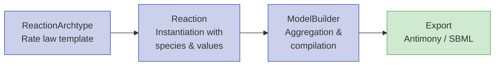

# Model Building

The [Quick Start](quick_start.md) guide covers the high-level `Builder` API for generating models from degree cascades. This page describes the underlying architecture, which is far more flexible — you can build arbitrary biochemical networks by composing reactions directly.

## The Three Layers

Every model in Synthetic is built from three composable layers:



### Layer 1: ReactionArchtype — The Template

An archtype defines a reaction's *structure*: what placeholder species it expects, what parameters it needs, and the rate law equation. Think of it as a function signature.

```python
from synthetic import ReactionArchtype

hill_archtype = ReactionArchtype(
    name='Hill Kinetics',
    reactants=('&S',),          # & prefix = placeholder reactant
    products=('&P',),           # & prefix = placeholder product
    parameters=('Vmax', 'Km', 'n'),
    rate_law='Vmax * &S^n / (Km^n + &S^n)',
    assume_parameters_values={'Vmax': 10, 'Km': 50, 'n': 2},
    assume_reactant_values={'&S': 100},
    assume_product_values={'&P': 0},
)
```

**Naming conventions for placeholders:**

| Prefix | Meaning | Example |
|--------|---------|---------|
| `&` | Forward reactant/product or regulator | `&S`, `&A0`, `&I0` |
| `?` | Reverse-only regulator (used in reversible reactions) | `?A0`, `?I0` |

**Key parameters:**

| Parameter | Description |
|-----------|-------------|
| `rate_law` | Mathematical expression using placeholder names and parameter names |
| `extra_states` | Placeholder names for regulators (species in the rate law but not reactants/products) |
| `reversible` | If `True`, a `reverse_rate_law` is also required |
| `assume_*_values` | Default values used when a `Reaction` doesn't specify its own |

!!! note "Placeholder naming convention"
    The `&` prefix marks main reactants, products, and regulators that participate in the forward direction. The `?` prefix marks regulators used only in the reverse direction of reversible reactions. These placeholders are replaced with actual species names when a `Reaction` is instantiated.

### Layer 2: Reaction — The Instance

A reaction binds an archtype to actual species names and concrete values. The placeholder `&S` becomes `EGFR`, `&P` becomes `pEGFR`, etc.

```python
from synthetic import Reaction

rxn = Reaction(
    reaction_archtype=hill_archtype,
    reactants=('EGFR',),
    products=('pEGFR',),
    reaction_name='egfr_phosphorylation',
    parameters_values={'Vmax': 15, 'Km': 60, 'n': 2},
    reactant_values={'EGFR': 120},
    product_values={'pEGFR': 0},
)
```

**Parameter values** can be provided as:

- A **dict** (recommended): `{'Vmax': 15, 'Km': 60}`
- A **tuple** (positional, must match archtype order): `(15, 60)`

**Initial concentrations** work the same way for `reactant_values` and `product_values`.

If values are omitted, the archtype's `assume_*_values` are used.

!!! warning "Default behavior: `zero_init=True`"
    By default, unspecified product and reactant concentrations default to 0. Set `zero_init=False` if you want to control every concentration explicitly.

#### Adding Regulation (Extra States)

Regulators are species that appear in the rate law but don't participate in mass balance. They model allosteric effects, competitive inhibition, etc.

```python
from synthetic import ArchtypeCollections

# Create an archtype with 1 competitive inhibitor
regulated_mm = ArchtypeCollections.create_archtype_michaelis_menten(
    competitive_inhibitors=1,
)

# The archtype now expects an extra state &I0 and a parameter Kic0
rxn = Reaction(
    reaction_archtype=regulated_mm,
    reactants=('S',),
    products=('Sa',),
    extra_states=('Inhibitor',),      # maps to archtype's &I0
    parameters_values={'Km': 100, 'Vmax': 10, 'Kic0': 0.1},
    reactant_values={'S': 100},
    product_values={'Sa': 0},
)
```

The **regulator-parameter mapping** is automatic based on parameter naming conventions:

| Parameter Prefix | Regulator Prefix | Regulation Type |
|-----------------|------------------|-----------------|
| `Ka`, `Ks` | `&A` | Allosteric stimulation |
| `Kw` | `&W` | Weak/additive stimulation |
| `Ki`, `Kil` | `&L`, `&I` | Allosteric inhibition |
| `Kic` | `&I` | Competitive inhibition |

### Layer 3: ModelBuilder — The Aggregator

`ModelBuilder` collects reactions, manages global state, and generates exportable model code.

```python
from synthetic import ModelBuilder

model = ModelBuilder('MyPathway')
model.add_reaction(rxn1)
model.add_reaction(rxn2)

# Required before accessing parameters/states or exporting
model.precompile()

# Inspect and modify
print(model.get_parameters())
print(model.get_state_variables())
model.set_parameter('Vmax_J0', 20.0)
model.set_state('EGFR', 150.0)
```

## Predefined Archtypes

`ArchtypeCollections` provides ready-made archtypes for common biochemical patterns:

### Simple Archtypes

| Name | Description | Rate Law |
|------|-------------|----------|
| `michaelis_menten` | Standard Michaelis-Menten | `Vmax*S/(Km + S)` |
| `simple_rate_law` | First-order kinetics | `kf*A` |
| `mass_action_21` | Reversible 2-to-1 binding | `ka*A*B` (fwd), `kd*C` (rev) |
| `synthesis` | Zero-order production | `Ksyn` |
| `degredation` | First-order decay | `Kdeg*A` |

### Configurable Factory Functions

These functions generate archtypes with the number and type of regulators you specify:

**`create_archtype_michaelis_menten(stimulators, stimulator_weak, allosteric_inhibitors, competitive_inhibitors)`**

The most commonly used factory. Generates a Michaelis-Menten rate law with `Vmax`:

```
(Vmax + W0*Kw0 + ...) * S * (A0*Ka0 + ...) / ((Km*(1 + I0*Kic0 + ...)) + S) * (1 + L0*Kil0 + ...)
```

**`create_archtype_michaelis_menten_v2(...)`**

Same regulation options, but uses `Kc` parameters instead of `Vmax`. Useful when you want each stimulator's contribution to be an independent parameter.

**`create_archtype_basal_michaelis(...)`**

A basal variant that retains `Kc` even with stimulators, representing constitutive activation plus regulation.

**`create_archtype_mass_action(reactant_count, product_count, ...)`**

Fully configurable mass action with forward and reverse regulation:

```python
from synthetic import ArchtypeCollections

arch = ArchtypeCollections.create_archtype_mass_action(
    reactant_count=2,
    product_count=1,
    allo_stimulators=1,        # forward stimulator
    allo_inhibitors=1,         # forward inhibitor
    rev_allo_inhibitors=1,     # reverse inhibitor
)
```

**`create_archtype_synthesis(allo_stimulators, allo_inhibitors)`**

Synthesis with optional regulation: `Ksyn * (A0*Ks0 + ...) * (1/(1 + I0*Ki0 + ...))`

**`create_archtype_degredation(allo_stimulators, allo_inhibitors)`**

Degradation with optional regulation: `Kdeg*R * (A0*Ks0 + ...) * (1/(1 + I0*Ki0 + ...))`

## Custom Archtypes

You can define entirely new rate laws. The only requirement is that the rate law string references all declared parameters and extra states.

```python
from synthetic import ReactionArchtype

# Cooperative binding with Hill coefficient
cooperative = ReactionArchtype(
    name='Cooperative MM',
    reactants=('&S',),
    products=('&P',),
    parameters=('Km', 'Vmax', 'n'),
    rate_law='Vmax * &S^2 / (Km^2 + &S^2)',
    assume_parameters_values={'Km': 50, 'Vmax': 10, 'n': 2},
    assume_reactant_values={'&S': 100},
    assume_product_values={'&P': 0},
)

# Substrate inhibition
substrate_inhibition = ReactionArchtype(
    name='Substrate Inhibition',
    reactants=('&S',),
    products=('&P',),
    parameters=('Vmax', 'Km', 'Ki'),
    rate_law='Vmax * &S / (Km + &S + &S^2/Ki)',
    assume_parameters_values={'Vmax': 10, 'Km': 50, 'Ki': 200},
    assume_reactant_values={'&S': 100},
    assume_product_values={'&P': 0},
)
```

## Putting It All Together

### Example: MAPK Cascade

A classic three-tier signaling cascade (Ras → Raf → MEK → ERK):

```python
from synthetic import (
    ModelBuilder, Reaction, ReactionArchtype,
    ArchtypeCollections,
)

# Use simple MM for each phosphorylation step
mm = ArchtypeCollections.michaelis_menten

reactions = [
    Reaction(
        reaction_archtype=mm,
        reactants=('Ras',),
        products=('pRaf',),
        reaction_name='ras_to_raf',
        parameters_values={'Km': 50, 'Vmax': 10},
        reactant_values={'Ras': 100},
        product_values={'pRaf': 0},
    ),
    Reaction(
        reaction_archtype=mm,
        reactants=('pRaf',),
        products=('pMEK',),
        reaction_name='raf_to_mek',
        parameters_values={'Km': 40, 'Vmax': 8},
        reactant_values={'pRaf': 0},
        product_values={'pMEK': 0},
    ),
    Reaction(
        reaction_archtype=mm,
        reactants=('pMEK',),
        products=('pERK',),
        reaction_name='mek_to_erk',
        parameters_values={'Km': 30, 'Vmax': 12},
        reactant_values={'pMEK': 0},
        product_values={'pERK': 0},
    ),
]

model = ModelBuilder('MAPK_Cascade')
for rxn in reactions:
    model.add_reaction(rxn)
model.precompile()

print(model.head())
```

### Example: Regulated Pathway with Feedback

A pathway where the output inhibits an upstream step (negative feedback):

```python
from synthetic import ModelBuilder, Reaction, ArchtypeCollections

# Forward reaction with competitive inhibition from downstream species
forward_arch = ArchtypeCollections.create_archtype_michaelis_menten(
    competitive_inhibitors=1,
)

# Simple MM for the second step
mm = ArchtypeCollections.michaelis_menten

# Step 1: S → Sa, inhibited by pO (negative feedback)
rxn1 = Reaction(
    reaction_archtype=forward_arch,
    reactants=('S',),
    products=('Sa',),
    extra_states=('pO',),                     # downstream product feeds back
    reaction_name='step1',
    parameters_values={'Km': 80, 'Vmax': 10, 'Kic0': 0.05},
    reactant_values={'S': 100},
    product_values={'Sa': 0},
)

# Step 2: Sa → pO
rxn2 = Reaction(
    reaction_archtype=mm,
    reactants=('Sa',),
    products=('pO',),
    reaction_name='step2',
    parameters_values={'Km': 50, 'Vmax': 8},
    reactant_values={'Sa': 0},
    product_values={'pO': 0},
)

model = ModelBuilder('FeedbackPathway')
model.add_reaction(rxn1)
model.add_reaction(rxn2)
model.precompile()

# Verify the feedback mapping
reg_map = model.get_regulator_parameter_map()
print(reg_map)  # {'pO': ['Kic0_J0']} — pO regulates Kic0 in reaction J0
```

### Example: Time-Dependent Drug Perturbation

Add a drug that activates at a specific time point:

```python
from synthetic import ModelBuilder, Reaction, ArchtypeCollections

mm = ArchtypeCollections.michaelis_menten

rxn = Reaction(
    reaction_archtype=mm,
    reactants=('Target',),
    products=('pTarget',),
    parameters_values={'Km': 50, 'Vmax': 10},
    reactant_values={'Target': 100},
    product_values={'pTarget': 0},
)

model = ModelBuilder('DrugResponse')
model.add_reaction(rxn)

# Drug concentration is 0 before t=500, then jumps to 100
model.add_simple_piecewise(
    before_value=0,
    activation_time=500,
    after_value=100,
    state_name='Drug',
)

model.precompile()
```

### Example: Combining Models

Merge two independently built models into one:

```python
from synthetic import ModelBuilder

model_a = ModelBuilder('Upstream')
model_b = ModelBuilder('Downstream')
# ... add reactions to each ...

combined = model_a.combine(model_b)
combined.precompile()
```

## Export and Simulation

After building and precompiling, export to standard formats:

```python
model.precompile()

# Antimony (text format, human-readable)
antimony_str = model.get_antimony_model()

# SBML (XML, interoperable with many tools)
sbml_str = model.get_sbml_model()

# Save to files
model.save_antimony_model_as('pathway.txt')
model.save_sbml_model_as('pathway.xml')

# Serialize the ModelBuilder object itself
model.save_model_as_pickle('pathway.pkl')
```

Then simulate with any solver (see [Solvers & Simulation](solvers_and_simulation.md)):

```python
from synthetic import ScipySolver

solver = ScipySolver()
solver.compile(antimony_str, jit=True)
results = solver.simulate(start=0, stop=1000, step=100)
```

## API Reference

For the complete, auto-generated API documentation of `ReactionArchtype`, `Reaction`, `ModelBuilder`, and all other classes, see the [API Reference](api_reference.md) page.

---

**See also:**

- [Network & Drug Design](network_and_drug_design.md) — using specs to generate networks with drugs and feedback
- [Solvers & Simulation](solvers_and_simulation.md) — simulating compiled models with different backends
- [Advanced Features](advanced_features.md) — kinetic tuning
- [Model Export](model_export.md) — export and interoperability
- [Benchmarking](benchmarking.md) — parameter estimation
