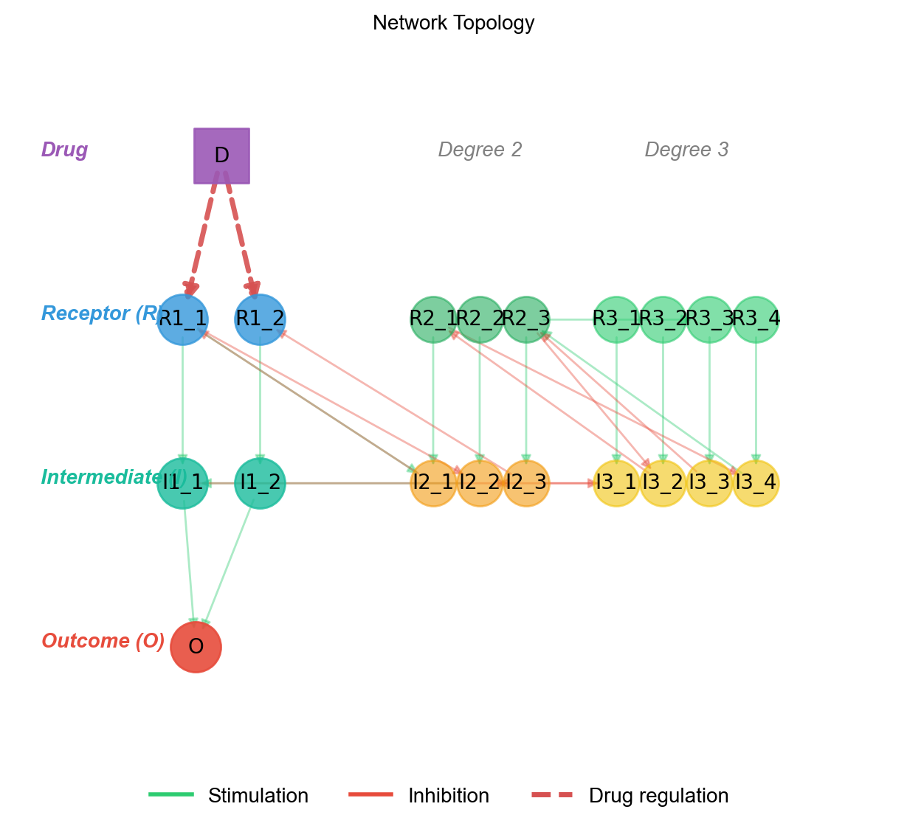

# Network & Drug Design

## Understanding Degree Cascades

The `degree_cascades` parameter defines the hierarchical structure of the signaling network. Each element specifies the number of parallel cascades at that degree:

```python
from synthetic.Specs.DegreeInteractionSpec import DegreeInteractionSpec

# 1. Spec Layer: Define the topology
spec = DegreeInteractionSpec(degree_cascades=[3, 6, 15])
spec.generate_specifications()

# 2. Model Layer: Generate the concrete ODE system
model = spec.generate_network("MyModel")
model.precompile()
```

This creates:

- **Degree 1** (3 cascades): `R1_1`, `R1_2`, `R1_3` (receptors) and `I1_1`, `I1_2`, `I1_3` (intermediates)
- **Degree 2** (6 cascades): `R2_1`...`R2_6` and `I2_1`...`I2_6`
- **Degree 3** (15 cascades): `R3_1`...`R3_15` and `I3_1`...`I3_15`
- **Outcome**: `O` (inactive) and `Oa` (activated)

### Species Naming Convention

| Pattern | Meaning | Example |
|---------|---------|---------|
| `R{deg}_{idx}` | Receptor species at degree `deg` | `R1_1`, `R2_3` |
| `I{deg}_{idx}` | Intermediate species at degree `deg` | `I1_1`, `I3_15` |
| `{name}a` | Activated form of a species | `R1_1a`, `I2_1a`, `Oa` |
| `O` / `Oa` | Outcome species (inactive / active) | — |

### Network Topology

Each cascade at degree `d` creates the reaction `R{d}_{i} -> I{d}_{i}`. Degree 1 intermediates connect to the outcome (`I1_{i} -> O`). Species at higher degrees regulate lower-degree species through the network's hierarchical structure.



Green edges indicate stimulation, red edges indicate inhibition, and dashed purple edges indicate drug regulation.

```
  Drug (D)
    |
    v
  R1_1 -> I1_1 --+
  R1_2 -> I1_2 --+--> O <-> Oa
  R1_3 -> I1_3 --+
    ^         ^
    |         |
  R2_1 .. R2_6  (degree 2 regulators)
    ^         ^
    |         |
  R3_1 .. R3_15 (degree 3 regulators)
```

## Feedback Regulation

The `feedback_density` parameter controls the proportion of possible feedback connections in the network:

```python
from synthetic.Specs.DegreeInteractionSpec import DegreeInteractionSpec

spec = DegreeInteractionSpec(degree_cascades=[3, 6, 15])
spec.generate_specifications(
    feedback_density=0.5,  # 50% of possible feedback connections
)

# Generate model
model = spec.generate_network("FeedbackModel")
model.precompile()
```

- `feedback_density=0`: No feedback (purely feed-forward hierarchy)
- `feedback_density=1`: Maximum feedback connections
- Feedback loops connect species across different degrees, creating more realistic network dynamics

## Building with Specs and Models

The recommended workflow for designing networks is to use the **Spec → Model** abstraction. This separates the network topology from the concrete biochemical implementation.

### 1. Define the Specification

The `Spec` layer defines what species exist and how they are connected.

```python
from synthetic.Specs.DegreeInteractionSpec import DegreeInteractionSpec

spec = DegreeInteractionSpec(degree_cascades=[1, 2, 5])
spec.generate_specifications(random_seed=42, feedback_density=0.5)
```

### 2. Generate the Model

The `ModelBuilder` layer translates the specification into a system of Ordinary Differential Equations (ODEs).

```python
# Generate the ODE model
model = spec.generate_network("MyModel", random_seed=42)

# Precompile to finalize parameters and state variables
model.precompile()
```

### 3. High-Level Automation (VirtualCell)

For automated workflows like data generation, the `VirtualCell` class (via `Builder.specify`) wraps this entire process:

```python
from synthetic import Builder

# Automates Spec -> ModelBuilder -> Kinetic Tuning
vc = Builder.specify(degree_cascades=[1, 2, 5])
```

## Adding Drugs

### Manual Drug Addition (Spec Layer)

Add drugs to your specification before generating the model:

```python
from synthetic.Specs.DegreeInteractionSpec import DegreeInteractionSpec
from synthetic.Specs.Drug import Drug

spec = DegreeInteractionSpec(degree_cascades=[1, 2, 5])
spec.generate_specifications()

# Create a drug targeting degree 1 receptors
drug = Drug(
    name="DrugX",
    start_time=500.0,
    regulation=["R1_1", "R1_2"],
    regulation_type=["down", "down"]
)

# Add drug to spec (with its concentration value)
spec.add_drug(drug, value=100.0)

# Generate and precompile the model
model = spec.generate_network("DruggedModel")
model.precompile()
```

### Automatic Drug Generation (VirtualCell Layer)

The high-level `VirtualCell` API can automate drug creation:

```python
# Auto-generates a drug "D" targeting all degree 1 receptors
vc = Builder.specify(
    degree_cascades=[1, 2, 5],
    auto_drug=True,
    drug_name="Inhibitor",
    drug_start_time=5000.0,
    drug_value=100.0,
    drug_regulation_type="down",
)
```

### Inspecting Drugs

List all drugs in the system:

```python
drugs = vc.list_drugs()
for drug in drugs:
    print(f"Drug: {drug['name']}, Targets: {drug['targets']}, Types: {drug['types']}")
```

### Drug Targeting Rules

!!! warning "Drugs must target degree 1 R species"
    Only degree 1 receptor species (e.g., `R1_1`, `R1_2`) are valid drug targets. Targeting species at other degrees will produce an error.

- Regulation types: `"up"` (stimulator effect) or `"down"` (inhibitor effect)
- Drugs appear at `start_time` via piecewise assignment rules

## Combination Therapy

Add multiple drugs to your specification to model combination therapy:

```python
from synthetic.Specs.DegreeInteractionSpec import DegreeInteractionSpec
from synthetic.Specs.Drug import Drug

spec = DegreeInteractionSpec(degree_cascades=[1, 2, 5])
spec.generate_specifications()

# Drug A targets pathway 1
spec.add_drug(Drug("DrugA", regulation=["R1_1"], regulation_type=["down"]), value=100.0)

# Drug B targets pathway 2
spec.add_drug(Drug("DrugB", regulation=["R1_2"], regulation_type=["down"]), value=100.0)

# Generate the model
model = spec.generate_network("CombinationModel")
model.precompile()
```

This enables you to:

- Test drug combinations with different targets
- Model synergistic or antagonistic effects
- Compare single-drug vs. combination therapies
- Validate combination therapy prediction algorithms

## Accessing the Model Layers

After using a specification to generate a model, you can access the underlying abstractions:

```python
from synthetic.Specs.DegreeInteractionSpec import DegreeInteractionSpec

spec = DegreeInteractionSpec(degree_cascades=[1, 2, 5])
spec.generate_specifications()
model = spec.generate_network("MyModel")
model.precompile()

# 1. Spec Layer - The network topology
print(spec.species_list)

# 2. Model Layer - The compiled ODE system
print(f"Species: {len(model.get_state_variables())}")
print(f"Parameters: {len(model.get_parameters())}")

# 3. Tuning (Optional) - Biologically plausible parameters
from synthetic.utils.kinetic_tuner import KineticParameterTuner
tuner = KineticParameterTuner(model)
# ... apply tuning ...
```


---

**See also:**

- [Data Generation](data_generation.md) — generating datasets from compiled models
- [Advanced Features](advanced_features.md) — kinetic tuning
- [Benchmarking](benchmarking.md) — parameter estimation
- [API Reference](api_reference.md) — full API docs for `Builder`, `VirtualCell`, and `Drug`
