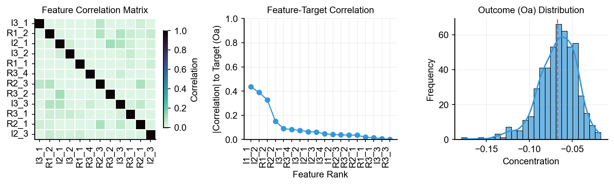

# Obtaining Data

A single simulation gives you one timecourse. To make a *dataset*, you need to vary the model — perturb initial conditions, perturb kinetic parameters, or both — and simulate each variation. That's what `make_dataset_drug_response` does.

This page covers the shape of the resulting dataset, the perturbation strategies, and how to control what's exposed per sample.

## The Basic Call

```python
from synthetic import Builder, make_dataset_drug_response

vc = Builder.specify(degree_cascades=[3, 6, 15], random_seed=42)

X, y = make_dataset_drug_response(
    n=1000,
    cell_model=vc,
    target_specie='Oa',
)

print(f"Features: {X.shape}")  # (1000, n_features)  — one column per species
print(f"Target:   {y.shape}")  # (1000,)             — one value per simulation
```

- `X` is a `pandas.DataFrame`. Each column is a species name (`R1_1`, `I1_1`, `Oa`, ...). Each row is one simulation.
- `y` is a `pandas.Series`. The value is the concentration of the target species at the end of the simulation.
- The two are aligned: row `i` of `X` and element `i` of `y` came from the same perturbed run.

The result drops into any scikit-learn workflow unchanged.

## Levels of Data per Sample

`make_dataset_drug_response` exposes a *spectrum* of information per simulation. You choose how much to take.

| Level | Flag | What you get per sample |
|---|---|---|
| 0 (default) | none | Initial-condition features (one per species) and the final value of the target species |
| 1 | `return_timecourse=True` | + full numpy-array timecourse for every species |
| 2 | (no flag — comes with level 1) | + DataFrame of kinetic parameters (`Km_J0`, `Vmax_J1`, ...) |
| 3 | (derived in user code) | Last-point features of the activated species, or any other timecourse-derived representation |

Level 0 is enough for most regression use cases. Level 1 unlocks the full simulation history — useful for parameter estimation (you can mimic sparse experimental observations), timecourse feature engineering, and validation. Level 3 is what ML papers actually compare when they ask "which feature representation predicts drug response best?" — see [Use Cases](use_cases.md#use-case-3-comparing-ml-models-on-different-feature-representations).

## What Gets Perturbed

By default, each sample uses a *conservation-rules* perturbation: the total concentration of each species pair (e.g., `R1_1 + R1_1a`) is held constant, but the *ratio* between the inactive and active forms is varied. This produces biologically plausible initial conditions — you never get "all zero" or "all active" start states.

To use a different distribution:

```python
# Gaussian perturbation of initial conditions
X, y = make_dataset_drug_response(
    n=100, cell_model=vc,
    perturbation_type='gaussian',
    perturbation_params={'rsd': 0.2},  # 20% relative standard deviation
)

# Lognormal perturbation
X, y = make_dataset_drug_response(
    n=100, cell_model=vc,
    perturbation_type='lognormal',
    perturbation_params={'rsd': 0.2},
)

# Latin Hypercube Sampling — better space-filling
X, y = make_dataset_drug_response(
    n=100, cell_model=vc,
    perturbation_type='lhs',
    perturbation_params={'rsd': 0.2},
)
```

| Type | Distribution | Parameters |
|------|--------------|------------|
| `conserve_rules` | Conservation-law ratio (default) | `shape`, `base_shape`, `max_shape` |
| `uniform` | Uniform | `min`, `max` |
| `gaussian` | Normal | `rsd` |
| `lognormal` | Log-normal | `rsd` |
| `lhs` | Latin Hypercube | `rsd` |

## Perturbing Kinetic Parameters Too

The initial conditions are one source of variation. The kinetic parameters (`Km`, `Vmax`, ...) are another, and they're often more predictive of drug response than initial concentrations. You can perturb both:

```python
X, y = make_dataset_drug_response(
    n=100, cell_model=vc,
    perturbation_type='gaussian',                     # for initial conditions
    perturbation_params={'rsd': 0.2},
    param_perturbation_type='lognormal',              # for kinetic parameters
    param_perturbation_params={'shape': 0.1},
    param_seed=42,                                    # separate seed from initial-cond perturbations
)
```

## Reproducibility

Two seeds control reproducibility:

- `random_seed` on `Builder.specify(...)` — fixes the *network topology* and the *drug configuration*.
- `seed` (and `param_seed`) on `make_dataset_drug_response(...)` — fixes the *perturbations* applied to generate samples.

Use both for fully reproducible datasets:

```python
vc = Builder.specify(degree_cascades=[3, 6, 15], random_seed=42)
X, y = make_dataset_drug_response(
    n=1000, cell_model=vc,
    seed=42,         # initial-condition perturbations
    param_seed=42,   # kinetic-parameter perturbations
)
```

## Extended Return Format

For ML research, you usually want more than `(X, y)` — you want the full timecourse and the kinetic parameters that produced each sample. Use `return_timecourse=True`:

```python
result = make_dataset_drug_response(
    n=500, cell_model=vc, target_specie='Oa',
    return_timecourse=True,
)

X            = result['X']            # feature matrix (initial conditions)
y            = result['y']            # target vector
timecourse   = result['timecourse']  # DataFrame of numpy arrays — one row per sample
parameters   = result['parameters']  # DataFrame of kinetic parameters per sample
metadata     = result['metadata']    # success rate, simulation range, etc.

print(f"Success rate: {metadata['success_rate']:.2%}")
```

The `timecourse` rows contain numpy arrays — one array per species, holding the concentration at each simulation timepoint. To extract, e.g., the last timepoint of each species per sample:

```python
import numpy as np
import pandas as pd

last_point_features = []
for _, sample_tc in timecourse.iterrows():
    last_point_features.append({
        col: arr[-1] for col, arr in sample_tc.items() if arr is not None
    })
X_last = pd.DataFrame(last_point_features)
```

See [Use Cases](use_cases.md) for end-to-end examples that consume this format — parameter estimation, classification, and ML model comparison.

## Controlling the Simulation

```python
X, y = make_dataset_drug_response(
    n=100, cell_model=vc,
    simulation_params={'start': 0, 'end': 8000, 'points': 101},
)
```

- `start` — simulation start time
- `end` — simulation end time (default uses the model's `simulation_end`, typically 10000)
- `points` — number of timepoints to record

## Solver Choice

By default, `make_dataset_drug_response` uses `ScipySolver` with `jit=True`. For other options:

```python
# ScipySolver (default, fast with JIT)
X, y = make_dataset_drug_response(n=100, cell_model=vc, solver_type='scipy', jit=True)

# RoadrunnerSolver (robust, full SBML)
X, y = make_dataset_drug_response(n=100, cell_model=vc, solver_type='roadrunner')

# HTTPSolver (remote)
X, y = make_dataset_drug_response(n=100, cell_model=vc, solver_type='http',
                                  solver_endpoint='http://localhost:8000/simulate')
```

See [Solving ODEs](solving_odes.md) for the comparison, JIT warmup cost, and the trade-offs between solvers.

## Feature Analysis: Which Species Matter?

In a hierarchical network, the degree 1 species (closest to the drug) usually correlate most strongly with the outcome. To check:

Top-left: feature correlation matrix. Top-right: feature-target correlation. Bottom: outcome distribution.



```python
correlations = X.apply(lambda col: col.corr(y))
correlations = correlations.reindex(correlations.abs().sort_values(ascending=False).index)
print("Top 10 features correlated with target:")
print(correlations.head(10))
```

For more sophisticated feature analysis — feature engineering from the full timecourse, comparing ML models across feature representations — see [Use Cases](use_cases.md#use-case-3-comparing-ml-models-on-different-feature-representations).

## Exporting Data

```python
X.to_csv('synthetic_features.csv', index=False)
y.to_csv('synthetic_targets.csv', index=False, header=['target'])
combined = pd.concat([X, y], axis=1)
combined.to_csv('synthetic_dataset.csv', index=False)
```

**Next: [Use Cases](use_cases.md)** — finished end-to-end examples that consume the dataset.
