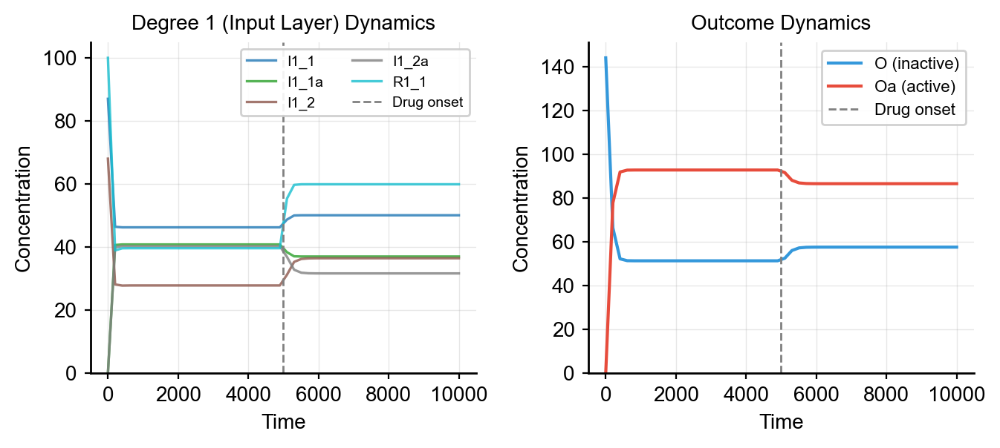

# Solvers & Simulation

## Solver Overview

Synthetic provides three solver backends for ODE simulation:

| Solver | Input Format | Features | Use Case |
|--------|-------------|----------|----------|
| **ScipySolver** | Antimony | JIT compilation via numba, fast batch | Default, parameter sweeps |
| **RoadrunnerSolver** | SBML | Full SBML support, robust | Complex models, single simulations |
| **HTTPSolver** | HTTP API | Remote simulation, distributed computing | Server-based workflows |

## Using the Built-in Solver

`make_dataset_drug_response` handles solver creation internally. Choose the backend with `solver_type`:

```python
from synthetic import Builder, make_dataset_drug_response

vc = Builder.specify(degree_cascades=[1, 2, 5], random_seed=42)

# Default: ScipySolver (fast, with JIT)
X, y = make_dataset_drug_response(n=100, cell_model=vc, solver_type='scipy', jit=True)

# Alternative: RoadrunnerSolver
X, y = make_dataset_drug_response(n=100, cell_model=vc, solver_type='roadrunner')
```

## Direct Solver Usage

For custom simulation workflows, use solvers directly.

=== "ScipySolver"

    Uses `scipy.integrate.odeint` with optional JIT compilation:

    ```python
    from synthetic import Builder
    from synthetic.Solver.ScipySolver import ScipySolver

    vc = Builder.specify(degree_cascades=[2, 3, 4], random_seed=42)

    # Get Antimony model string
    antimony = vc.model.get_antimony_model()

    # Compile and simulate
    solver = ScipySolver()
    solver.compile(antimony, jit=True)  # Enable JIT for faster execution
    results = solver.simulate(start=0, stop=10000, step=50)

    print(results.head())
    ```

=== "RoadrunnerSolver"

    Uses libRoadRunner for SBML simulation:

    !!! warning "Requires SBML format"
        RoadrunnerSolver requires SBML, not Antimony. Use `model.get_sbml_model()`.

    ```python
    from synthetic.Solver.RoadrunnerSolver import RoadrunnerSolver

    # Get SBML model string
    sbml = vc.model.get_sbml_model()

    solver = RoadrunnerSolver()
    solver.compile(sbml)
    results = solver.simulate(start=0, stop=10000, step=50)
    ```

### Simulation Output

Both solvers return a pandas DataFrame with a `time` column and one column per species:

```
       time    R1_1   R1_1a    I1_1   I1_1a      O      Oa
0       0.0  100.00    0.00  100.00    0.00  100.0    0.0
1      50.0   95.23    4.77   98.10    1.90   99.5    0.5
2     100.0   91.50    8.50   96.40    3.60   98.8    1.2
...
```

## Timecourse Simulation

Simulate and visualize species dynamics over time. The vertical dashed line marks drug onset:


```python
from synthetic import Builder
from synthetic.Solver.ScipySolver import ScipySolver
import matplotlib.pyplot as plt

vc = Builder.specify(degree_cascades=[2, 3, 4], random_seed=42)

antimony = vc.model.get_antimony_model()
solver = ScipySolver()
solver.compile(antimony, jit=False)
timecourse = solver.simulate(start=0, stop=10000, step=50)

# Plot outcome dynamics
fig, ax = plt.subplots()
ax.plot(timecourse['time'], timecourse['O'], label='O (inactive)')
ax.plot(timecourse['time'], timecourse['Oa'], label='Oa (active)')
ax.axvline(x=5000, color='gray', linestyle='--', label='Drug onset')
ax.set_xlabel('Time')
ax.set_ylabel('Concentration')
ax.legend()
plt.show()
```

### Comparing Solvers

Run the same simulation with both solvers to compare results. Both produce identical dynamics:



=== "ScipySolver"

    ```python
    from synthetic.Solver.ScipySolver import ScipySolver

    solver_scipy = ScipySolver()
    solver_scipy.compile(vc.model.get_antimony_model(), jit=False)
    tc_scipy = solver_scipy.simulate(start=0, stop=10000, step=50)
    print(f"ScipySolver Oa: {tc_scipy['Oa'].iloc[-1]:.4f}")
    ```

=== "RoadrunnerSolver"

    ```python
    from synthetic.Solver.RoadrunnerSolver import RoadrunnerSolver

    solver_rr = RoadrunnerSolver()
    solver_rr.compile(vc.model.get_sbml_model())
    tc_rr = solver_rr.simulate(start=0, stop=10000, step=50)
    print(f"RoadrunnerSolver Oa: {tc_rr['Oa'].iloc[-1]:.4f}")
    ```

## HTTP Solver for Remote Simulation

The `HTTPSolver` sends simulation requests to a remote server via HTTP. This is useful for distributed computing or when the simulation engine runs on a separate machine.

### Client Usage

```python
from synthetic.Solver.HTTPSolver import HTTPSolver

solver = HTTPSolver()

# Connect and validate endpoint
solver.compile("http://localhost:8000/simulate")

# Get default states and parameters
states = solver.get_state_defaults()
params = solver.get_parameter_defaults()

# Override values
solver.set_state_values({"R1_1": 1000.0})
solver.set_parameter_values({"Km_J0": 10.0})

# Run simulation
results = solver.simulate(start=0, stop=60, step=0.5)
```

### Server Setup

The HTTP solver requires a server implementing the simulation API. See `examples/httpsolver_api.md` for the full API specification. A minimal FastAPI server:

```python
from fastapi import FastAPI
from pydantic import BaseModel
from typing import Dict, Optional

app = FastAPI()

class SimulationRequest(BaseModel):
    start: float
    stop: float
    step: float
    state_values: Optional[Dict[str, float]] = None
    parameter_values: Optional[Dict[str, float]] = None

@app.get("/states")
async def get_states():
    return {"S1": 100.0, "S1a": 0.0}

@app.get("/parameters")
async def get_parameters():
    return {"Vmax_J0": 100.0, "Km_J0": 50.0}

@app.post("/simulate")
async def simulate(req: SimulationRequest):
    # Run simulation with requested parameters
    return {"time": [req.start, req.stop], "S1": [100.0, 90.0], "S1a": [0.0, 10.0]}
```

## Solver Selection Guide

| Scenario | Recommended Solver |
|----------|-------------------|
| Default dataset generation | ScipySolver (`solver_type='scipy'`) |
| Batch simulations (1000+ samples) | ScipySolver with `jit=True` |
| Complex SBML models | RoadrunnerSolver |
| Need robust single simulations | RoadrunnerSolver |
| Remote/distributed computing | HTTPSolver |
| Parameter estimation loops | ScipySolver with `jit=False` |

!!! info "JIT warmup"
    The first call to `ScipySolver.simulate()` with `jit=True` compiles the ODE function via Numba, which can take several seconds. Subsequent simulations are fast. This is a one-time cost per model.

---

**See also:**

- [Data Generation](data_generation.md) — using solvers to generate datasets
- [Advanced Workflows](advanced_workflows.md) — parameter estimation with solvers
- [API Reference](api_reference.md) — full API docs for solver classes
