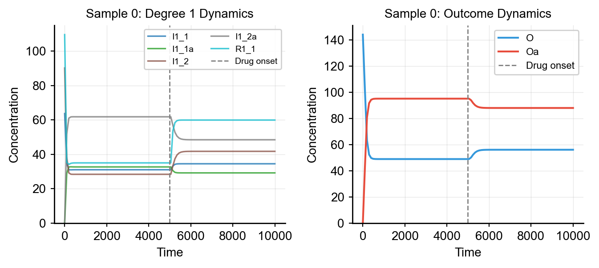
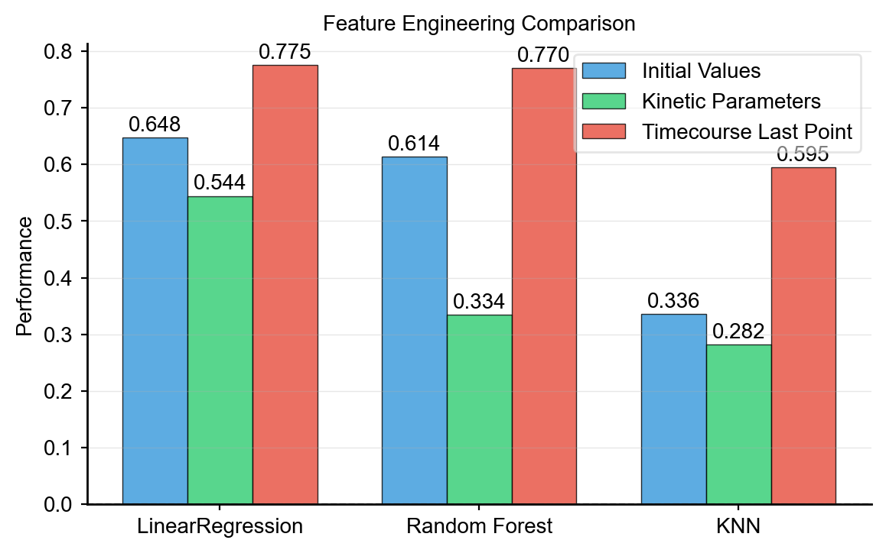

# Use Cases

Finished end-to-end examples you can copy and adapt. Each one is a complete workflow from [Model Building](model_building.md) through [Obtaining Data](obtaining_data.md) into a concrete ML or scientific task.

For the conceptual material — what a model is, what a solver does, how perturbation strategies work — see the preceding pages in the Usage section.

---

## Use Case 1 — Parameter Estimation

Synthetic models can serve as ground truth for testing parameter estimation methods. Since you know the true parameters, you can validate calibration algorithms. Typically, in real experiments, you have sparse timecourse data for a few species, so we will mimic that scenario.

### Setup: Ground Truth + Sparse Observations

```python
import numpy as np
from synthetic import Builder
from synthetic.Solver.ScipySolver import ScipySolver

# Build a small model with known parameters
vc = Builder.specify(degree_cascades=[1, 2], random_seed=42)

# Simulate dense ground truth
antimony = vc.model.get_antimony_model()
solver = ScipySolver()
solver.compile(antimony, jit=False)
timecourse_full = solver.simulate(start=0, stop=10000, step=201)

# Store ground truth
true_params = vc.model.get_parameters()
true_initial = vc.model.get_state_variables()

# Downsample to sparse observations (mimicking real experiments)
DRUG_TIME = 5000.0
sparse_times = np.array([5000, 5500, 6000, 6500, 7000, 7500, 8000, 8500, 9000, 9500, 10000])
sparse_indices = [np.argmin(np.abs(timecourse_full['time'].values - t)) for t in sparse_times]
timecourse_sparse = timecourse_full.iloc[sparse_indices].reset_index(drop=True)
```

### Parameter Selection

Select identifiable parameters for estimation (typically `Km` and `Vmax` values):

```python
param_names = [p for p in true_params.keys() if p.startswith('Km_') or p.startswith('Vmax_')][:12]
true_values = np.array([true_params[p] for p in param_names])
```

### Objective Function

Define an objective that simulates with trial parameters and computes MSE against sparse observations:

```python
species_to_fit = [s for s in timecourse_sparse.columns if s != 'time']

def objective(log_params):
    trial_params = dict(zip(param_names, np.exp(log_params)))
    solver.set_state_values(true_initial)
    solver.set_parameter_values(trial_params)

    try:
        tc = solver.simulate(start=0, stop=10000, step=201)
    except Exception:
        return 1e10  # Penalty for failed simulation

    sim_indices = [np.argmin(np.abs(tc['time'].values - t)) for t in sparse_times]
    residuals = []
    for sp in species_to_fit:
        sim_vals = tc[sp].values[sim_indices]
        obs_vals = timecourse_sparse[sp].values
        residuals.append((sim_vals - obs_vals) ** 2)

    return np.mean(residuals)
```

### Optimization

Run optimization in log-space to enforce positivity:

```python
from scipy.optimize import minimize

# Perturbed initial guess
initial_values = true_values * np.random.uniform(0.3, 3.0, size=len(param_names))
log_initial_guess = np.log(initial_values)
log_bounds = [(np.log(0.01 * tv), np.log(100.0 * tv)) for tv in true_values]

result = minimize(
    objective,
    log_initial_guess,
    method='L-BFGS-B',
    bounds=log_bounds,
    options={'maxiter': 200, 'ftol': 1e-12},
)

estimated_values = np.exp(result.x)
```

### Evaluating Results

Compare estimated parameters to ground truth:

Sparse timecourse observations (dots) overlaid on the ground-truth trajectory.


```python
for i, p in enumerate(param_names):
    err = abs(estimated_values[i] - true_values[i]) / true_values[i] * 100
    print(f"{p:<15} True: {true_values[i]:.3f}  Estimated: {estimated_values[i]:.3f}  Error: {err:.1f}%")
```

Simulate with estimated parameters to visualize the fit:

True vs. initial-guess vs. estimated parameter values.


Timecourse with estimated parameters (dashed) vs. ground truth (solid).


```python
solver.set_state_values(true_initial)
solver.set_parameter_values(dict(zip(param_names, estimated_values)))
timecourse_fitted = solver.simulate(start=0, stop=10000, step=201)
```

---

## Use Case 2 — Classification (Responder vs Non-Responder)

Synthetic's `make_dataset_drug_response` returns a regression target — the *value* of the activated outcome. Many real ML problems are framed as classification instead: "did this patient respond to the drug, yes or no?" The dataset Synthetic produces is perfectly fine input to a classifier — you just need to threshold the target.

This is a fully *user-side* transformation. There's no library helper for it, because the threshold choice is the scientific question you're trying to ask.

```python
from synthetic import Builder, make_dataset_drug_response
from sklearn.ensemble import RandomForestClassifier
from sklearn.model_selection import cross_val_score, cross_val_predict
from sklearn.metrics import classification_report, confusion_matrix
import numpy as np

# 1. Build a model and generate the regression dataset.
vc = Builder.specify(degree_cascades=[3, 6, 15], random_seed=42)
X, y = make_dataset_drug_response(n=1000, cell_model=vc, target_specie='Oa')

# 2. Threshold y into a binary class — e.g. "responder" if Oa < median, else "non-responder".
#    The threshold choice encodes the question you're asking.
threshold = np.median(y)
y_class = (y < threshold).astype(int)   # 1 = responder, 0 = non-responder
print(f"Threshold: Oa < {threshold:.2f}  →  responder")
print(f"Class balance: {y_class.mean():.2%} responder")

# 3. Train a classifier with cross-validation.
clf = RandomForestClassifier(n_estimators=200, random_state=42, n_jobs=-1)
cv_scores = cross_val_score(clf, X, y_class, cv=5, scoring='accuracy')
print(f"5-fold CV accuracy: {cv_scores.mean():.3f} ± {cv_scores.std():.3f}")

# 4. Inspect predictions in more detail.
y_pred = cross_val_predict(clf, X, y_class, cv=5)
print("\nConfusion matrix (rows=true, cols=predicted):")
print(confusion_matrix(y_class, y_pred))
print("\nClassification report:")
print(classification_report(y_class, y_pred, target_names=['non-responder', 'responder']))
```

The threshold (`np.median(y)`) is arbitrary. For a real study, you might use:

- a clinically meaningful cutoff (e.g., "50% reduction in `Oa` from baseline")
- a percentile of the simulated `y` distribution (e.g., the bottom 25%)
- a value from prior experimental data

The rest of the pipeline is unchanged — same `X`, same classifiers, same metrics you would use on any binary classification problem.

---

## Use Case 3 — Comparing ML Models on Different Feature Representations

The default `X` from `make_dataset_drug_response` is *initial conditions* — one column per species, one row per sample. But you can also use the *kinetic parameters* of each simulation, or features *extracted from the timecourse*, as your ML input. The same `y` works for all three.

A single-sample timecourse, with the degree 1 receptors responding first to the drug and the signal propagating to `Oa`:

Single sample: degree 1 receptor dynamics and the `Oa` outcome over time.



The full workflow, end-to-end:

```python
from sklearn.linear_model import LinearRegression
from sklearn.ensemble import RandomForestRegressor
from sklearn.model_selection import cross_val_score
from synthetic import Builder, make_dataset_drug_response
import numpy as np
import pandas as pd

# 1. Build a model
vc = Builder.specify(degree_cascades=[3, 6, 15], random_seed=42)

# 2. Generate a dataset with full timecourse data exposed.
#    (See "Levels of data per sample" in Obtaining Data.)
result = make_dataset_drug_response(
    n=1000, cell_model=vc, target_specie='Oa',
    return_timecourse=True,
)
X = result['X']                   # initial conditions — default
y = result['y']
parameters = result['parameters'] # kinetic parameters per sample
timecourse = result['timecourse'] # DataFrame of numpy arrays — one row per sample

# 3. Feature representation 1: initial conditions (the default X)
r2_initial = cross_val_score(LinearRegression(), X, y, cv=5, scoring='r2').mean()

# 4. Feature representation 2: kinetic parameters
r2_params = cross_val_score(LinearRegression(), parameters, y, cv=5, scoring='r2').mean()

# 5. Feature representation 3: last-timepoint of each activated species from the timecourse
last_point_features = []
for _, sample_tc in timecourse.iterrows():
    last_point_features.append({
        col: arr[-1] for col, arr in sample_tc.items() if arr is not None
    })
X_tc = pd.DataFrame(last_point_features)
X_tc = X_tc[[c for c in X_tc.columns if c.endswith('a') and c != 'Oa']]  # activated species only
r2_tc = cross_val_score(LinearRegression(), X_tc, y, cv=5, scoring='r2').mean()

print(f"Initial values R^2:  {r2_initial:.3f}")
print(f"Kinetic params R^2:  {r2_params:.3f}")
print(f"Timecourse last-point R^2: {r2_tc:.3f}")
```

Predictive performance across ML models for the three feature representations:

Predictive performance across ML models for three feature representations.



A common finding in hierarchical networks: degree 1 species (the ones closest to the drug) correlate most strongly with `Oa`. Initial conditions alone often beat raw kinetic parameters, but combining the two — initial conditions *and* last-point timecourse features — usually wins.

---

**Next: [Advanced](advanced.md)** — extending the library: custom specs, custom rate laws, custom solvers, custom data-processing patterns.
